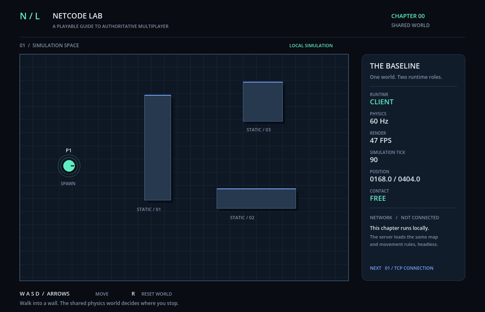

# 第 00 章：从零准备环境，运行一个共享物理世界

这系列笔记会逐步实现一个「客户端先响应输入、服务端计算权威结果、客户端收到结果后纠正预测」的网络同步 Demo。每章独立提供完整源码和说明。

**从第 00 章起，先准备后续章节共用的环境，运行客户端和无窗口服务端，验证相同输入下的移动与碰撞。** 本章尚未联网，无需网络编程基础，按下面七步操作即可。



## 为什么双端都用 Godot

如果客户端用物理碰撞挡住角色，服务端却只做 `位置 += 速度 × 时间`，两端遇到墙就会算出不同结果。因此两端都使用 Godot，共用地图、角色和移动规则；客户端显示画面，服务端以 Headless（无窗口）模式运行。

后续由服务端检查输入并计算权威结果，客户端提前预测以减少操作延迟。服务端不直接采信客户端上报的位置，有利于防止篡改移动结果的作弊。

## 第一步：取得源码与附件

从本章仓库 **Code → Download ZIP** 下载并解压，或用 Git 克隆。找到包含 `project.godot`、`setup.bat` 和 `run-client.bat` 的目录，后面称为“本章目录”。

本章在 Windows 11 x64 上验证，环境如下：

| 工具 / 配置 | 版本要求与用途 |
| --- | --- |
| Python | 支持 **3.11+**，已验证 **3.11.9**；运行工具脚本 |
| Godot | **4.7.2 stable 标准版**；运行客户端与服务端 |
| 游戏语言 | GDScript，随 Godot 提供 |
| 物理 / 渲染 | GodotPhysics2D，固定 **60 Hz**；Compatibility / OpenGL |

安装目录自定；其他 Godot 版本可用于探索，但尚未验证兼容性，启动脚本会检查版本。

安装包可从官方下载：

- [Python 3.11.9 Windows x64 安装程序](https://www.python.org/ftp/python/3.11.9/python-3.11.9-amd64.exe)
- [Godot 4.7.2 标准版 Windows x64 ZIP](https://github.com/godotengine/godot/releases/download/4.7.2-stable/Godot_v4.7.2-stable_win64.exe.zip)

也可从 [第 00 章 Release](https://github.com/mrshen/godot-netcode-00-baseline/releases/tag/chapter-00-v0.1.0) 的 **Assets** 下载同版本安装包与校验清单。[downloads](downloads/README.md) 提供使用和校验说明；源码 ZIP 不含安装包。

## 第二步：安装工具

工具安装在章节目录之外，后续章节共用。以下以 `D:\Tools` 为例；安装包可保留在 `D:\Tools\installers`。

1. **Python：** 已有 3.11+ 可直接复用。首次安装选择 **Customize installation**，保留 **pip**，将目录设为 `D:\Tools\Python311`。
2. **Godot：** 将 ZIP 完整解压到 `D:\Tools\Godot\4.7.2`，保留普通 EXE 和 `_console.exe`；后者便于查看日志。

下文命令均在 **Windows CMD** 中运行，路径按实际安装位置替换。先检查版本：

```bat
"D:\Tools\Python311\python.exe" --version
"D:\Tools\Godot\4.7.2\Godot_v4.7.2-stable_win64_console.exe" --version
```

参考输出为 `Python 3.11.9` 和 `4.7.2.stable.official.ed1daf0bf`。找不到文件或版本不符时，先检查 EXE 路径。

## 第三步：配置共享路径

进入本章目录，把示例配置复制到章节共同的上级目录；已有配置会保留：

```bat
cd /d D:\syncDemo\godot-netcode-00-baseline
if not exist ..\environment.local.bat copy environment.example.bat ..\environment.local.bat
notepad ..\environment.local.bat
```

将其中两行改为实际路径并保存：

```bat
if not defined NETCODE_PYTHON set "NETCODE_PYTHON=D:\Tools\Python311\python.exe"
if not defined NETCODE_GODOT set "NETCODE_GODOT=D:\Tools\Godot\4.7.2\Godot_v4.7.2-stable_win64_console.exe"
```

配置保存在 `D:\syncDemo\environment.local.bat`，与各章目录并列，只需配置一次。Git / GitHub CLI 为可选工具，未安装可删除对应配置行。

BAT 会读取这些路径，无需修改系统 PATH。已有 PATH 或希望用 `NETCODE_ENV` 指定其他配置位置，见 [环境说明](docs/ENVIRONMENT.md#2-只配置一次路径)。

## 第四步：检查环境

以下命令都在本章目录执行：

```bat
.\setup.bat
```

它只检查已安装的工具。确认输出的 Python、Godot 版本和路径正确，并出现：

```text
ENVIRONMENT OK: Python and Godot are ready.
```

按任意键返回终端。本章 `requirements.txt` 没有第三方 Python 包，无需执行 `pip install`；Godot 等独立程序的版本记录在 `toolchain.lock.json`。

| 检查失败 | 处理方法 |
| --- | --- |
| 找不到 Python / Godot | 检查共享配置位置和 EXE 路径，用第二步的命令确认能启动 |
| Python 低于 3.11，或提示 `Expected Godot 4.7.2-stable` | 将配置指向符合要求的版本 |
| 只提示 Git / gh 缺失，末尾仍为 `ENVIRONMENT OK` | 不影响本章运行，可继续 |

## 第五步：运行客户端

```bat
.\run-client.bat
```

窗口应显示网格地图、三个障碍物和青绿色 `P1`。面板显示 `RUNTIME: CLIENT`、`PHYSICS: 60 Hz`，`SIMULATION TICK` 持续增长。`NETWORK / NOT CONNECTED` 是本章的正常状态。

用 `WASD` 或方向键操作，按顺序试一遍：

| 操作 | 预期现象与原因 |
| --- | --- |
| 从出生点一直向右 | 在中间长墙前停住，X 约为 338；碰撞限制了位移 |
| 顶墙时同时向右、向上 | 沿墙向上滑动；朝墙内的位移被挡住 |
| 按 `R`，比较直线和斜向移动 | 重置位置与 Tick；斜向不会更快，因为输入长度受限 |

Tick 是模拟步数，FPS 是每秒渲染帧数，两者不同。若窗口立即关闭或出现 `SCRIPT ERROR`，检查终端报错、引擎版本及源码完整性。

**客户端运行期间占用当前终端。完成观察后关闭游戏窗口，再继续下一步。** 要打开编辑器，可运行 `run-client.bat --editor`。

## 第六步：运行服务端

```bat
.\run-server.bat --ticks 180
```

没有游戏窗口，终端应出现：

```text
BASELINE role=server physics_hz=60 network=none
SERVER tick=120 position=(168.0, 404.0) (idle; networking begins in chapter 01)
```

完成 180 Tick 后自动退出，约几秒。日志每 120 Tick 打印一次；角色留在出生点，因为尚未收到网络输入。若未正常运行，先检查终端报错并重跑环境检查。

可选实验：省略 `--ticks 180` 持续运行服务端，另开 CMD 进入本章目录并启动客户端。移动客户端角色，服务端仍在原位——共享代码不会自动传递输入。观察后关闭客户端，服务端用 `Ctrl+C` 停止；若询问是否终止批处理，输入 `Y`。

## 第七步：验证双端模拟

```bat
.\verify.bat
```

脚本先检查项目导入，再让两个运行入口各执行相同的 360 Tick 输入，检查碰撞、滑动、斜向速度、边界与静止行为，并比较 6 个检查点。默认无窗口运行，约十几秒。

**成功时两端均为 `passed=true`，末尾出现两行 `PASS`：**

```text
VERIFY role=client passed=true ticks=360 samples=6
VERIFY role=server passed=true ticks=360 samples=6
PASS: import, wall collision, sliding, normalized diagonal movement, boundaries, idle.
PASS: both runtime roles matched at 6 checkpoints / 360 ticks (tolerance 0.001).
```

结束后按任意键返回。想看自动移动过程，可用 `verify.bat --rendered-client`。失败时查看 `artifacts/` 中的日志和 JSON 报告，检查引擎版本、60 Hz 设置，以及地图或速度是否被改动。

验证通过表示当前环境和场景的检查点相符；同一引擎仍不保证跨平台、跨版本的物理结果完全确定，详见 [Godot 物理说明](https://docs.godotengine.org/en/stable/tutorials/physics/physics_introduction.html)。

**环境检查通过、客户端操作正常、服务端正常退出、双端验证通过，即完成本章。**

## 对照现象读代码

| 文件 | 关注内容 |
| --- | --- |
| [main.gd](main.gd) | 选择运行角色，读取输入并推进模拟 |
| [shared/world.gd](shared/world.gd) / [shared/map_layout.gd](shared/map_layout.gd) | 创建共同的地图、碰撞体与出生点 |
| [shared/player.gd](shared/player.gd) | 输入归一化、移动速度与碰撞滑动 |
| [client/presentation.gd](client/presentation.gd) | 根据模拟状态绘制画面 |
| [verification/scenario.gd](verification/scenario.gd) | 固定输入与检查点 |

小练习：将 `shared/player.gd` 的 `SPEED` 从 240 改为 120，观察移动变慢，再运行验证。预期距离不符会使验证失败，说明它也检查具体行为。完成后恢复 240 并重新验证。

## 下一章

目前两个进程还不能通信。第 01 章计划加入 TCP 连接与消息收发，观察连接、断开，以及如何从字节流中划分完整消息；输入上传与服务端权威计算从第 02 章接入，随后逐步加入预测与纠正。各章继续复用本章环境，完整计划见 [笔记路线](docs/ROADMAP.md)。

更多说明：[环境配置](docs/ENVIRONMENT.md) · [架构设计](docs/ARCHITECTURE.md) · [附件与校验](downloads/README.md) · [仓库发布](docs/PUBLISHING.md)。

源码采用 [MIT License](LICENSE)；工具许可见 [THIRD_PARTY_NOTICES.md](THIRD_PARTY_NOTICES.md)。
