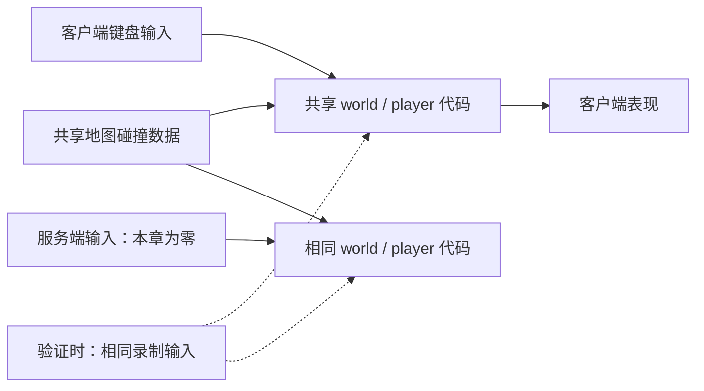

# 第 00 章设计

## 一份项目，两个运行角色

同一 Godot 项目通过 `--role=client` 或 `--role=server` 启动。服务端同时使用引擎参数 `--headless`，省略图形窗口。发布独立服务器包可以再使用 Godot 的专用服务器导出；本章使用引擎直接运行源码，便于读者修改和观察。

两个进程各自持有世界状态和物理空间；它们复用的是代码和资源，不是运行时内存。本章没有客户端到服务端的数据通道。

## 固定步长

`main.gd` 在 `_physics_process(delta)` 中调用 `world.step(command, delta)`。项目设置固定 60 Hz。渲染在 `_process(delta)` 中更新，读取世界状态；呼吸光环和尾迹不会参与碰撞计算。

渲染帧数不等于模拟 Tick。固定步长说明每次逻辑推进使用规定的时间长度，不保证性能不足时仍能实时完成 60 次计算，也不保证 Godot 物理跨平台完全一致。

## 共享移动与碰撞

`shared/map_layout.gd` 保存地图边界、出生点和障碍物矩形。`shared/world.gd` 用这些数据创建静态碰撞体，并创建圆形角色碰撞体。

`shared/player.gd` 接收方向指令，以 240 单位/秒移动，使用 `move_and_collide` 检测本次位移。如果撞到物体，将剩余位移投影到接触面上继续滑动。斜向输入限制长度为 1，避免斜向加速。

这个简化的俯视角角色控制器没有重力、楼梯、移动平台和动态刚体。它让输入、固定步长、碰撞与共享模拟的关系更容易观察。

## 为什么服务端也运行 Godot

权威模拟需要知道角色能否穿过墙，以及输入最终产生什么合法状态。仅仅共享速度常量不够，两端还要共享碰撞数据、角色形状、物理设置和运动规则。

无窗口 Godot 能直接复用这些资源。后续网络层仍由我们逐步实现，不会因为采用引擎物理而自动获得同步、预测或重演。

## 后续同步边界

- 服务端校验输入后自行计算结果，客户端上传的位置不会直接成为权威状态。
- 客户端预测使用同一份规则，但网络延迟和未知的世界状态仍会造成分歧。
- 后续需要明确输入序号、服务端确认、状态保存、纠正与未确认输入重演。
- 共享 Godot 物理不等于确定性保证。本章验证只覆盖指定版本、机器和静态场景。
- 加入动态物体时，要考虑历史碰撞世界，不能只恢复玩家坐标就假定重演正确。

参考：[Godot 专用服务器](https://docs.godotengine.org/en/stable/tutorials/export/exporting_for_dedicated_servers.html)、[Godot 物理说明](https://docs.godotengine.org/en/stable/tutorials/physics/physics_introduction.html)。
